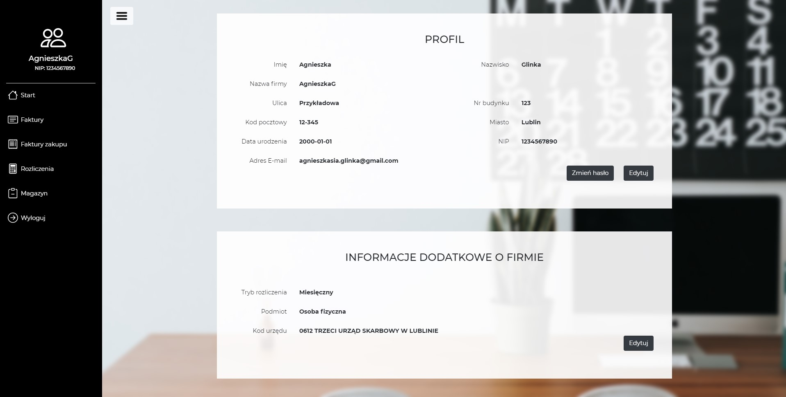
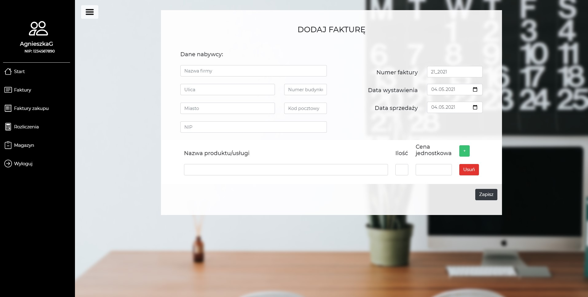
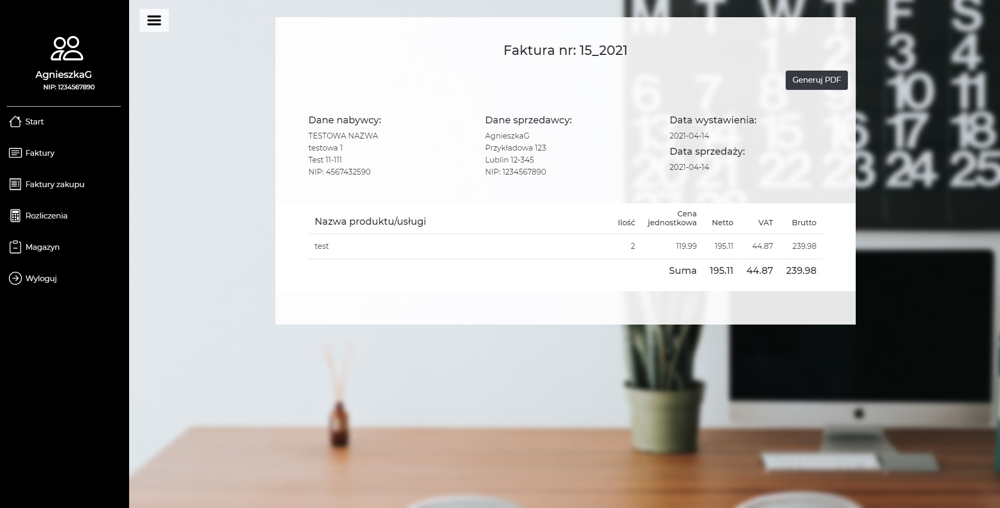
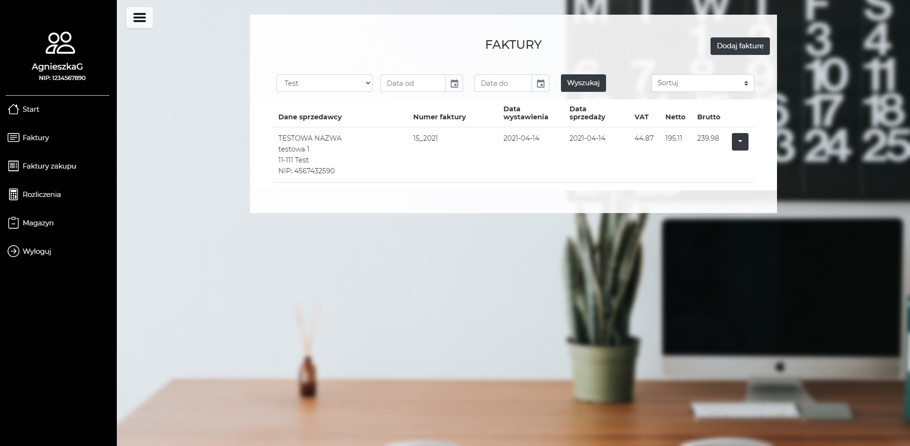
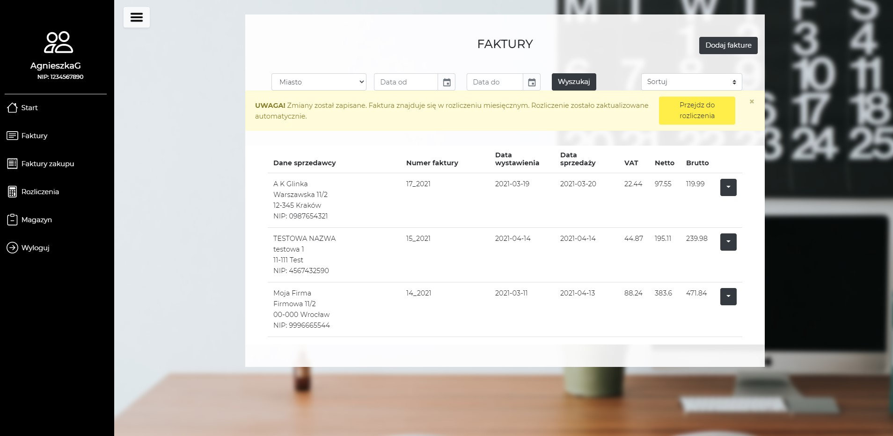
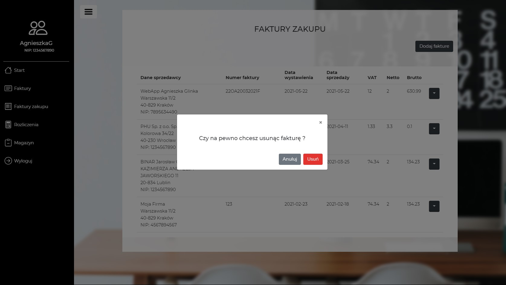
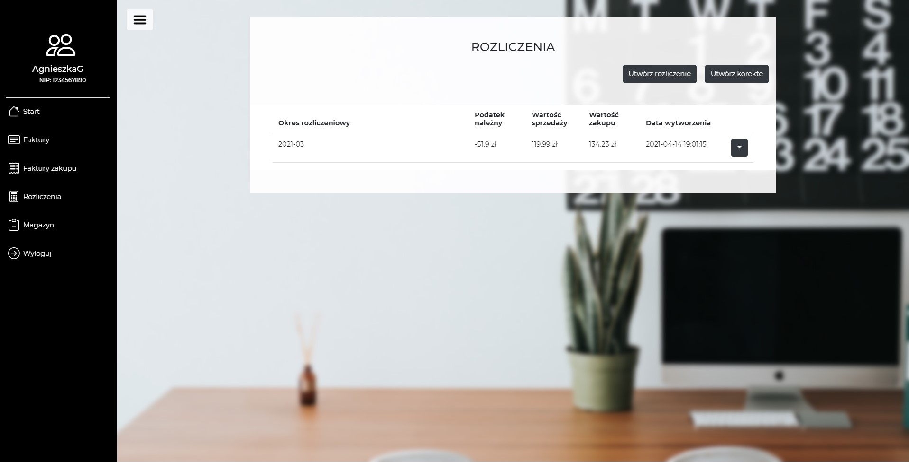
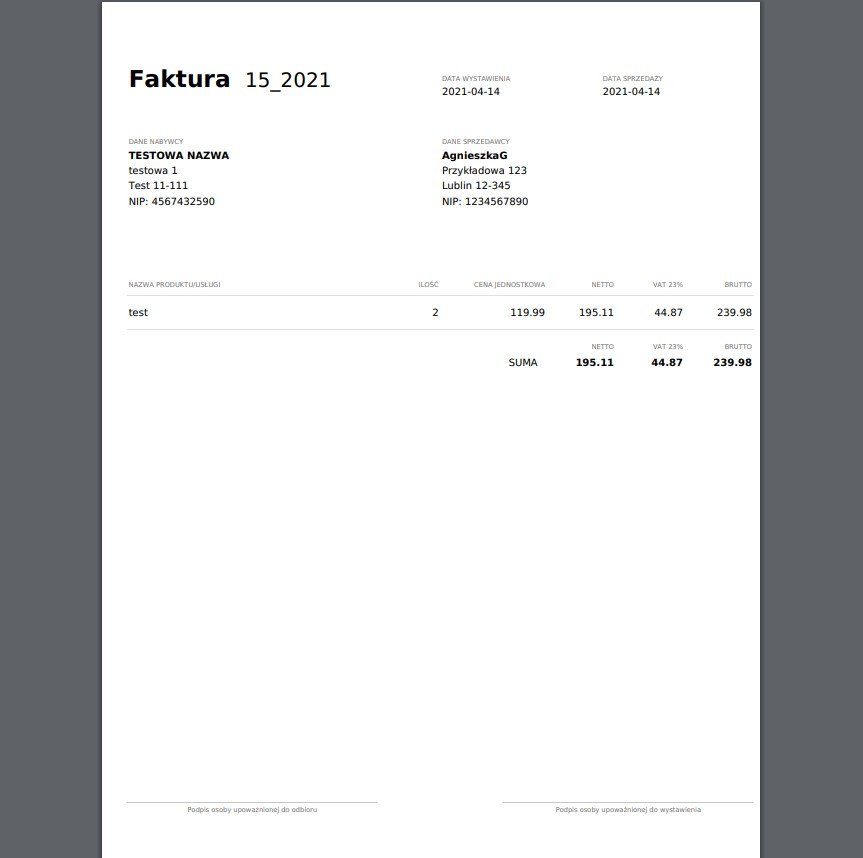

# JPKprogram
JPKprogram is a platform that facilitates the management of company's accounting. Allows you to:
* management of sales and purchase invoices
* creating invoices in pdf format
* creating JPK files for monthly settlements
* creating a warehouse of products and services
	
## Technologies
Project is created with:
* PHP 8.0.2
* Laravel 8.28
* Bootstrap 4
* Apache server
* MySQL database
	
## Installation
To run this project:

* Download project
* Put project folder inside htdocs folder (path is something like this C:\xampp\htdocs)
* Start the Apache server in the XAMPP Control Panel
* Go to the browser and type in URL field: localhost/JPKprogram/public

## Application functionality
* Login, registration users
* Changing user password
* Reseting user password via link send in email
* Adding, viewing, editing, deleting sales invoices
* Adding, viewing, editing, deleting purchase invoices
* Filtering and sorting sales and purchase invoices
* Generating sales invoices as PDF file
* Creating a monthly tax settlement based on user invoices
* Viewing, deleting monthly tax settlement
* Sorting tax settlements
* Genereting a monthly tax settlement as XML file

